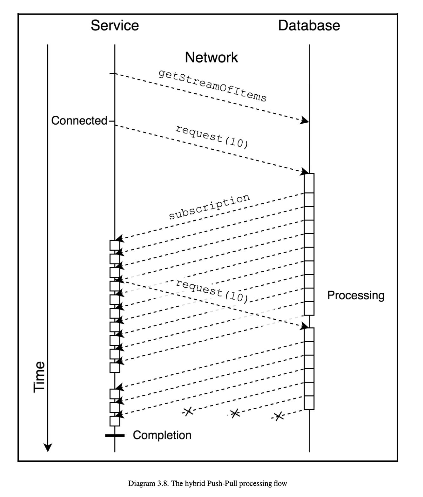

# 스트림의 새로운 표준 - 리액티브 스트림

## 모두를 위한 반응성

이 장에서는 리액티브 스트림 스펙을 따라 구현된 라이브러리를 이용해야 하는 이유에 대해 설명한다.

### API 불일치 문제

비동기 논블로킹 작업을 위한 여러가지 라이브러리가 있는데, 하나의 작업단위에 여러 라이브러리가 같이 존재하는 경우 복잡해진다.

예를 들어, 자바 코어 라이브러리에 존재하는 비슷한 개념의 인터페이스가 아래와 같이 2가지가 존재하고 하나의 코드에서 사용하는 경우가 있다고 하자.

* CompletionStage
* ListenableFuture

둘다 비동기 작업 완료 후 작업 처리를 위해 제공되는 인터페이스로, spring 4 에서는 하위호환성을 위해 Future 인터페이스를 확장한 ListenableFuture 인터페이스를 제공하였고 비동기 rest api 호출 용도의 라이브러리인 AsyncRestTemplate 클래스의 리턴 타입으로도 사용된다.

ListenableFuture 인터페이스는 성공, 실패에 대한 콜백을 등록하여 사용하는데 결과에 대한 처리를 위해 콜백 코드를 등록해야하고 콜백 코드가 추가되면서 콜백지옥을 경험하게 될 수도 있다.

조금 더 간단하고 확장성을 위해 \(콜백 지옥을 피하기 위해\) CompletionStage 인터페이스가 추가되었는데, 이 인터페이스는 함수형 스타일로 코드를 작성할 수 있다. 

다음 비교 코드를 보자. \(간단히 비교를 위해 어떤 블로그에서 참조한 코드.\)

**ListenableFutre 를 이용한 코드.**

```java
ListenableFutureTask listenableFutureTask = new ListenableFutureTask(task);
        listenableFutureTask.addCallback(new ListenableFutureCallback() {
            @Override
            public void onFailure(Throwable throwable) {
                System.out.println("exception occurred!!");
            }

            @Override
            public void onSuccess(Object o) {
                ListenableFutureTask listenableFuture = new ListenableFutureTask(task);
                listenableFuture.addCallback(new ListenableFutureCallback() {
                    @Override
                    public void onFailure(Throwable throwable) {
                        System.out.println("exception occurred!!");
                    }

                    @Override
                    public void onSuccess(Object o) {
                        System.out.println("all tasks completed!!");
                    }
                });
                listenableFuture.run();
            }
        });
        listenableFutureTask.run();
```

**CompletionStage 인터페이스를 이용한 코드.**

```java
 CompletableFuture
                .runAsync(task)
                .thenCompose(aVoid -> CompletableFuture.runAsync(task))
                .thenAcceptAsync(aVoid -> System.out.println("all tasks completed!!"))
                .exceptionally(throwable -> {
                    System.out.println("exception occurred!!");
                    return null;
                });
```

api 불일치 문제에 대한 내용을 이해하기 위해 ListenableFuture, CompletionStage 에 대해 잠시 살펴보았고 다시 불일치 문제로 돌아오면, spring 4 에서는 비동기 api 통신을 위해 AsyncRestTemplate 클래스를 제공해주었는데 해당 클래스의 리턴타입이 **ListenableFutre 인터페이스이고 위에서 확인했다시피 콜백코드 때문 코드가 지저분해지게 된다**. 그래서 보통 CompletionStage 인터페이스로 변환하여 사용하는 경우가 많다.

이렇게 변환하여 사용하는 경우에 서로 다른 인터페이스 2가지를 사용하게 되고 api 리턴 타입의 불일치가 발생하므로 이를 해결하기 위해 새로운 유틸성 클래스를 생성해주어야 한다.

**AsyncAdapters \(api 불일치를 해결하기 위한 아답터 클래스\)**

```java
public final class AsyncAdapters {
    // rest api 완료 후 completaionStage 로 변환하는 코드
    public static <T> CompletionStage<T> toCompletion(ListenableFuture<T> future) {

        CompletableFuture<T> completableFuture = new CompletableFuture<>();

        future.addCallback(completableFuture::complete,
                completableFuture::completeExceptionally);

        return completableFuture;
    }

    // controller에서 작업 리턴을 위해 completionStage 코드를 LinstenableFuture 로 변환하는 코드
    public static <T> ListenableFuture<T> toListenable(CompletionStage<T> stage) {
        SettableListenableFuture<T> future = new SettableListenableFuture<>();

        stage.whenComplete((v, t) -> {
            if (t == null) {
                future.set(v);
            }
            else {
                future.setException(t);
            }
        });

        return future;
    }
}
```

위와 같이 유틸성 클래스를 추가하는 경우, 사용자가 직접 코드를 작성하게 되는데 이때 버그가 유입될 가능성이 크고 자신도 모르는 사이에 문제점이 발생할 여지가 있다.

### ------

### 풀 방식과 푸시 방식

> 푸시 방식 : 퍼블리셔가 자신을 구독하고 있는 구독자에게 직접 데이터를 전송해주는 방식 \(생산자가 소비자에게 내\)
>
> 풀 방식 : 구독자가 퍼블리셔에게서 데이터를 요청해서 받아오는 방식  \(실제 주문 요청이 있을때 생산하여 제공. 소비자가 생성자에게로 요청\)

이 절은 예제코드로 풀 방식과 푸시 방식의 차이점에 대해 설명한다.

위 풀, 푸시 방식의 비교 개념을 이해하고 순수한 풀 방식의 경우를 예제 코드로 살펴보자.

**예제코드1** \(순수한 풀 방식\)

```java
public class Puller {

	final AsyncDatabaseClient dbClient = ...

	// count = 10 으로 호출 (ex. puller.list(10); )
 	public CompletionStage<Queue<Item>> list(int count) {
		BlockingQueue<Item> storage = new ArrayBlockingQueue<>(count);
		CompletableFuture<Queue<Item>> result = new CompletableFuture<>();

		pull("1", storage, result, count);
		
		sout("비동기 논블로킹으로 db 를 호출하였으므로 여기가 젤 먼저 출력됨");
		return result;
	}

	void pull(String elementId,
			Queue<Item> queue,
			CompletableFuture resultFuture,
			int count) {
		dbClient.getNextAfterId(elementId)
		        .thenAccept(item -> {
							// getNextAfterId() 의 결과가 리턴될때까지 기다린 후 실행되며, 10까지 +1 씩 상승/반
			        if (isValid(item)) {
				        queue.offer(item);

				        if (queue.size() == count) {
					        resultFuture.complete(queue);
					        return;
				        }
			        }

			        pull(item.getId(), queue, resultFuture, count);
		        });
	}

	boolean isValid(Item item) {...}
}
```

서비스\(Puller\) 에서 데이터베이스\(dbClient\) 를 호출할때는 비동기 논블로킹으로 호출하였지만, count\(10\) 를 모두 처리할때는 +1씩 올리면서 코드를 반복한다. 해당 과정은 thenAccept 부분에서 블로킹 되므로 **서비스에서 데이터베이스로의 요청\(pull\) 시간** 때문에 비효율적인 코드이다. 

**예제코드2** \(순수한 풀 방식 개선\)

```java
public class Puller {

	final AsyncDatabaseClient dbClient = ...

	public CompletionStage<Queue<Item>> list(int count) {
		BlockingQueue<Item> storage = new ArrayBlockingQueue<>(count);
		CompletableFuture<Queue<Item>> result = new CompletableFuture<>();

		pull("1", storage, result, count);

		return result;
	}

	void pull(String elementId,
			Queue<Item> queue,
			CompletableFuture resultFuture,
			int count) {
		// 서비스가 데이터베이스를 요청할때 10 개를 한번에 처리하도록 함.
		dbClient.getNextBatchAfterId(elementId, count)
		        .thenAccept(items -> {
							// 완료된 items 를 for 문안에서 한번에 처리한다. (이없으면 10개)
			        for (Item item : items) {
				        if (isValid(item)) {
					        queue.offer(item);

					        if (queue.size() == count) {
						        resultFuture.complete(queue);
						        return;
					        }
				        }
			        }

							// 위 작업 완료될때까지 대기중...
			        pull(items.get(items.size() - 1)
			                  .getId(), queue, resultFuture, count);
		        });
	}

	boolean isValid(Item item) {...}
}

```

첫 예제의 순수한 풀 방식과의 차이점은 10개를 한번에 배치처리 한다는 점이다. 하지만 데이터베이스에서 10개를 모두 처리할때까지 thenAccept 함수에서 블로킹 되며 여전히 클라이언트는 대기시간하는 존재한다.

**예제코드3** \(푸시방식\)

```java
public class DelayedFakeAsyncDatabaseClient implements AsyncDatabaseClient {

	// range 가 Integer.MAX_VALUE 이기 때문에 서비스의 요청이 끝나 계속 생성될 문제가 있음.
	@Override
	public Observable<Item> getStreamOfItems() {
		return Observable.range(1, Integer.MAX_VALUE)
		                 .map(i -> new Item("" + i))
		                 .delay(50, TimeUnit.MILLISECONDS)
		                 .delaySubscription(100, TimeUnit.MILLISECONDS)
	}
}

public class Puller {

	final AsyncDatabaseClient dbClient = ...

	public Observable<Item> list(int count) {
		return dbClient.getStreamOfItems()
		               .filter(this::isValid)
		               .take(count);
	}

	boolean isValid(Item item) {...}
}

```

count 를 모두 처리할때까지 블로킹 되는 구간이 없다. 데이터베이스에서 처리가 완료되는 즉시 서비스로 푸시를 해주고 서비스에서는 원하는 count 개수가 나올때까지 데이터베이스가 전송해주는 값을 받아오므로, **데이터베이스에게 데이터를 요청하는 요청 시간이 추가적으로 들지 않는다.**

### ------

### 흐름 제어

위와 같이 푸시방식은 요청 횟수를 최소화하여 처리 시간을 최적화하지만, 퍼블리셔는 컨슈머\(소비자\)의 처리능력을 무시하고 데이터를 계속 생산하는 문제가 있다.

두 가지 문제상황에 대해 살펴보자.

* **느린 프로듀서와 빠른 컨슈머**

첫 번째 상황은 프로듀서가 컨슈머의 처리속도를 가늠하지 못하기 때문에  데이터를 느리게 주는 상황일 것이다. 해당 상황의 문제점은 컨슈머의 처리속도가 일정하지 않을 수 있고 프로듀서의 서버가 스케일업이 되는 경우가 생길 수도 있다. 

* **빠른 프로듀서와 느린 컨슈머** 

 컨슈머가 처리할 수 있는 속도보다 프로듀서가 더 많은 데이터를 주게되면 시스템의 부하가 올 수 있다. 이러한 문제를 해결하기 위해 간단한 처리 방법은 처리되지 않는 데이터에 대해 큐\(queue\) 를 이용하여 관리하는 것이다. 


3가지 유형의 큐가 있으며 하나씩 살펴보자.

**Unbounded Queue**


원소들을 큐에 모두 받는다. 모든 메세지를 처리할 수 있는 이점이 있지만, 컨슈머 혹은 큐의 안정성이 떨어짐.


**Bounded drop Queue**


  큐가 가득차면 신규 유입된 메세지를 무시한다. 메시지의 중요성이 낮은 이벤트성 메시지에 대해서 사용을 고려해볼 수 있다. \(어떤 메세지를 삭제할건지의 전략도 따로있으므로 혹시 관심이 있다면 따로 찾아보자.\)


**Bounded blocking Queue**


위의 큐와는 다르게 메세지를 삭제하는 것이 아닌 블로킹하는 큐. 해당 큐는 비동기 동작을 무시한다. 큐의 한계에 도달하면  차단이 시작되고 컨슈머측에서 여유공간이 생길때까지 차단 상태가 된다. 가장 느린 컨슈머 때문에 다른 컨슈머들도 차단 상태가 되기 때문에 비동기의 이점이 사라진다.

### ------

### 해결책

해결책은 리액티브 스트림의 기본 스펙을 살펴보자.

### 

### ------

### 리액티브 스트림의 기본 스펙

Publisher, Subscriber, Subscription, Processor 네가지 인터페이스가 존재.

**Publisher** 

데이터 발행 후 데이터를 전송할 대상인 Subscriber 를 등록

```java
public interface Publisher<T> {
    public void subscribe(Subscriber<? super T> s);
}
```

\*\*\*\*

**Subscriber**

onSubscribe : publisher 의 subscribe\(\) 메소드가 정상호출되면 호출되는 메소드

onNext, onError, onComplete\(\) 는 데이터 발행 성공, 실패, 완료 시 호출되는 메소

```java
public interface Subscriber<T> {
    public void onSubscribe(Subscription s);
    public void onNext(T t);
    public void onError(Throwable t);
    public void onComplete();
}
```

\*\*\*\*

**Subscription**

request : Subscriber 가 publisher 에게 원하는 원소의 개수를 요청. 해당 메소드 호출 시 Publisher 가 Subscriber 에게 데이터를 발행해줌.

cancel : 구독 취소 시 사용함.

```java
public interface Subscription {
    public void request(long n);
    public void cancel();
}
```

\*\*\*\*

**Processor**

Publisher, Subscriber 의 역할/작업을 모두 수행할때 사용하는 인터페이스.

```java
public interface Processor<T, R> extends Subscriber<T>, Publisher<R> {
}
```


하이브리드 푸시-풀 모델에 대한 예제코드를 살펴보자. \(리액티브 기본 스펙으로 구현된 예제\)



예시 코드를 살펴보기전에 리액티브 기본 스펙을 이용한 코드를 사용한 경우의 플로우는 위의 이미지와 같다. \(요청 때문에 추가적인 시간 소모 없이 전체 처리시간 최소화\)

 중복된 코드를 호출 순서대로 설명하기 위해 모두 복붙... \(호출 순서대로 보자\)

 1. puller 인스턴스를 생성하고 list\(10\) 메소드를 호출한다

```java
Puller puller = new Puller();
		puller.list(10)
		      .subscribe(new Subscriber<Item>() {
			      final ArrayList<Item> list = new ArrayList<>();

			      @Override
			      public void onSubscribe(Subscription s) {
				      s.request(Long.MAX_VALUE);
			      }
			
			      @Override
			      public void onNext(Item item) {
				      list.add(item);
			      }

			      @Override
			      public void onError(Throwable t) {

			      }

			      @Override
			      public void onComplete() {
				      MatcherAssert.assertThat(list, Matchers.allOf(
						      Matchers.hasSize(10),
						      Matchers.contains(
								      Matchers.hasProperty("id", Matchers.equalTo("2")),
											...
								      Matchers.hasProperty("id", Matchers.equalTo("20"))
						      )
				      ));
			      }
		      });
```

 2. dbClient 객체의 getStreamOfItems\(\) 메소드를 호출 \(비동기 논블로킹\) 후

TakeFilterOperator 클래스를 생성한다. 

getStreamOfItems\(\) 메소드는 Publisher 인터페이스의 구현체인 Flowable 추상클래스이기 때문에 Publisher 의 특성에따라 구독이 되기전까지 데이터를 발행하지 않는다.

```java
public class Puller {

	final AsyncDatabaseClient dbClient = ...

	public Publisher<Item> list(int count) {
		Publisher<Item> source = dbClient.getStreamOfItems();
		TakeFilterOperator<Item> takeFilter =
				new TakeFilterOperator<>(source, count, this::isValid);

		return takeFilter;
	}

	boolean isValid(Item item) {...}
}
	
	
public class DelayedFakeAsyncDatabaseClient implements AsyncDatabaseClient {

	@Override
	public Publisher<Item> getStreamOfItems() {
		return Flowable.range(1, Integer.MAX_VALUE)
		               .map(i -> new Item("" + i))
		               .delay(50, TimeUnit.MILLISECONDS)
		               .hide()
		               .subscribeOn(Schedulers.io())
		               .delaySubscription(100, TimeUnit.MILLISECONDS);
	}
}

```

 3. TakeFilterOperator 클래스 \(Publisher 를 구현한 클래스. 간단히 생성자만 참고\)

```java
public class TakeFilterOperator<T> implements Publisher<T> {

	private final Publisher<T> source;
	private final int          take;
	private final Predicate<T> predicate;

	public TakeFilterOperator(Publisher<T> source, int take, Predicate<T> predicate) {
		this.source = source;
		this.take = take;
		this.predicate = predicate;
	}
	....
	}
```

 4. Puller 클래스의 list\(\) 메소드가 완료되면 Publisher 타입의 takeFilter 변수를 리턴.

```java
public class Puller {

	final AsyncDatabaseClient dbClient = ...

	public Publisher<Item> list(int count) {
		Publisher<Item> source = dbClient.getStreamOfItems();
		TakeFilterOperator<Item> takeFilter =
				new TakeFilterOperator<>(source, count, this::isValid);

		return takeFilter;
	}

	boolean isValid(Item item) {...}
}
```

 5. 다시 처음 코드를 보면 .subscriber\(\) 메소드를 통해 publisher 에 Subscriber \(구독자\) 등록을 진행한다. 

new Subscriber&lt;Item&gt; 타입의 구독자를 등록시키고 있다.

```java
Puller puller = new Puller();
		puller.list(10)
		      .subscribe(new Subscriber<Item>() {
			      final ArrayList<Item> list = new ArrayList<>();

			      ...
		      });
```

 6. puller 는 TakeFilterOperator 클래스 타입의 takeFilter 변수를 리턴받았기 때문에 .subscriber\(\) 호출되면 TakeFilterOperator 클래스의 .subscriber\(\) 가 호출된다.

```java
public class TakeFilterOperator<T> implements Publisher<T> {

	private final Publisher<T> source;
	private final int          take;
	private final Predicate<T> predicate;

	public TakeFilterOperator(Publisher<T> source, int take, Predicate<T> predicate) {
		this.source = source;
		this.take = take;
		this.predicate = predicate;
	}

	public void subscribe(Subscriber s) {
		source.subscribe(new TakeFilterInner<>(s, take, predicate));
	}
	...
	}
```

 7. 위 코드에서 source 변수를 통해 TakeFilterInner 클래스를 구독자로 등록하고 있으며 subscribe\(\) 메소드 내부에서 onSubscriber\(\) 메소드를 호출하므로 바로 TakeFilterInner 클래스의 onSubscribe\(\) 메소드가 호출된다.

```java
// TakeFilterInner 클래스의 onSubscribe()
// current 는 TakeFilterInner 클래스이며
// this.actual.onSubscribe(this) 의 actual 은 puller 의 onSubscribe() 이다.
public void onSubscribe(Subscription current) {
			if (this.current == null) {
				this.current = current;

				this.actual.onSubscribe(this);
				if (take > 0) {
					this.current.request(take);
				} else {
					onComplete();
				}
			}
			else {
				current.cancel();
			}
		}
```


 8. puller 의 onSubscribe\(\). 

s.request\(Long.MAX\_VALUE\); 메소드를 호출한다. 여기서 파라미터 s 는 TakeFilterInner 클래스의 request\(\) 메소드로 유효성 검사를 진행하는 코드이다. \(해당 챕터 공부 시 중요한 부분이 아니므로 넘어간다.\) 

TakeFilterInner 클래스의 request\(\) 메소드에서 유효성 검사가 끝나면 다시 **위 7번 코드**의 this.current.request\(take\); 메소드를 호출.

```java
puller.list(10)
		      .subscribe(new Subscriber<Item>() {
			      final ArrayList<Item> list = new ArrayList<>();

			      @Override
			      public void onSubscribe(Subscription s) {
				      s.request(Long.MAX_VALUE);
			      }
			...
			}
```

9. this.current.request\(take\) 메소드가 호출되면, 위에서 설명했듯이 Publisher 가 구독자에게 데이터 발행을 시작하고, 구독자는 onNext\(\) 메소드를 통해 publisher 가 전달한 데이터를 받는다,

onNext\(\) 메소드의 하위 내용은 

1. publisher 가 발행한 데이터를 유효성 검사 후 queue 에 저장하고
2. queue 의 사이즈가 처음 요청한 10개와 동일한지 검사 후
3. 구독 취소 && onComplete\(\) 호

```java
public void onNext(T element) {
			if (done) {
				return;
			}

			long r = requested;
			Subscriber<T> a = actual;
			Subscription s = current;

			if (remaining > 0) {
				boolean isValid = predicate.test(element);
				boolean isEmpty = queue.isEmpty();

				if (isValid && r > 0 && isEmpty) {
					a.onNext(element);
					remaining--;

					REQUESTED.decrementAndGet(this);
					if (remaining == 0) {
						s.cancel();
						onComplete();
					}
				}
				else if (isValid && (r == 0 || !isEmpty)) {
					queue.offer(element);
					remaining--;

					if (remaining == 0) {
						s.cancel();
						onComplete();
					}
					drain(a, r);
				}
				else if (!isValid) {
					filtered++;
				}
			}
			else {
				s.cancel();
				onComplete();
			}
```

간단히 하이브리드 푸시-풀 모델 코드를 살펴보았다. 

puller 에서 처음 풀 하고나서 구독자 등록 후 부터는 푸시를 통해 프로세스가 진행하기 때문에, 추가적인 데이터 요청 시간이 필요하지 않으며, 구독자는 필요한 양만큼만 데이터를 요청하고 또 onComplete, onError 를 통해 구독이 끝나게 되면 더이상 데이터를 생산하지 않기 때문에 시스템 안정성도 좋아진다. 


### ------

### 리액티브 스트림 동작해보기

리액티브 스트림 스펙을 한번 더 이해하기 위한 과정으로 예제코드 대신 블로그 글에서 참조한 이미지로 대신해보자.. 


### Processor 개념의 소개

Publisher 와 Subscriber 를 혼합한 개념으로 두 스펙 사이에 Processor 를 위치시켜 추가적인 작업을 할 수 있도록 설계 되다. 


* Subscriber 를 여러개 등록하고 특정 조건 맞는 Subscriber 에게만 결과를 전송하고 싶을때
* publisher, subscriber 상관없이 처리하고 싶을때 \(코드1 참\)
* 다수의 subscriber 에게 데이터를 같이 전달해주고 싶을때 \(코드2\)


**코드1** 

reactor core 3.x 버전에서 지원해주는 DirectProcessor 로 배압을 지원하지 않음. \(직접 구현 필요\)

```java
DirectProcessor<Long> data = DirectProcessor.create();
data.subscribe(t -> System.out.println(t),
        e -> e.printStackTrace(),
        () -> System.out.println("Finished 1"));
data.onNext(10L);
data.onComplete();
data.subscribe(t -> System.out.println(t),
        e -> e.printStackTrace(),
        () -> System.out.println("Finished 2"));
data.onNext(12L);
```

\*\*\*\*

**코드2**

reactor core 3.x 버전에서 지원해주는 EmitterProcessor 로 배압을 지원

여러 구독자에게 동기적으로 데이터를 전달하는 방식으로 추후 뒷절에서 더 자세히 설명이 나올듯..


```java
EmitterProcessor<Long> data = EmitterProcessor.create(1);  // 배압 적용 가
data.subscribe(t -> System.out.println(t));  // 구독자 등장
FluxSink<Long> sink = data.sink(); // 발행인 등장
sink.next(10L); // 10
sink.next(11L); // 11
sink.next(12L); // 12
data.subscribe(t -> System.out.println(t));  // 새로운 구독자 등장
sink.next(13L); // 13 (기존 구독자)
                // 13 (새로운 구독자)     
sink.next(14L); // 위 결과에서 14추가
sink.next(15L); // 위 결과에서 15추가
```


Processor 는 코드를 복잡하게 만들기 때문에 재사용 가능한 코드를 만들기가 어렵고 필요에 따라서는 직접 배압을 구현해야할 수도 있다. 특별한 상황이 아닌 경우에는 사용을 피해야 한다고 함.


참고








