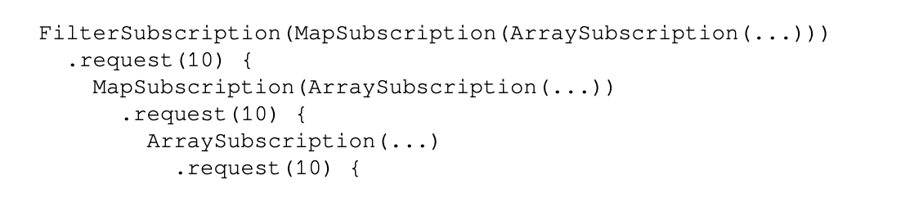
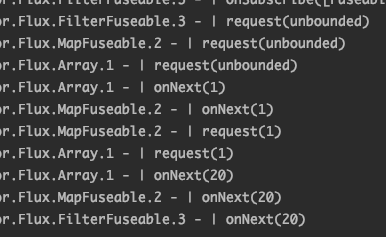
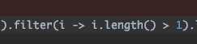

# 리액터 프로젝트 - 리액티브 앱의 기초

## 리액티브 스트림의 수명 주기

### 조립 단계

리액터에서는 빌더패턴과 비슷한 형태로 연산자들을 조립할 수 있도록 제공한다.

빌더 패턴은 하나의 객체에 대해 새로운 메서드가 추가됨과 동시에  객체의 데이터가 변경되지만,  
리액터에서는 불변으로 메서드\(연산자\)가 추가되어도 객체의 내용이 변하지  않고 새로운 객체가 생성된다.

각 연산과정에서 도출된 sourceFlux, mapFlux, filterFlux 는 모두 새로운 객체로 생성된다.

조립의 또 다른 예시. \(내부적으로 최적화가 진행되는 경우\)

concatWith 연산자로 각 변수들을 조합\(조립\)하여 출력한다.

concnatWith 연산자의 내부코드를 보면 변수의 타입이 FluxConcatArray 인지 여부에 따라 다른 함수를 사용하고 있다. 

concatAdditionalSourceLast\(\) 함수에서는 FluxConcnatArray 로 변환시키면서 se1, se2, se3 각 데이터를 모두 하나의 array 에 담아서 리턴.

최적화 진행 결과.

FluxConcatArray\(FluxConcatArray\(FluxA, FluxB\), FluxC\) 

FluxConcatArray\(FluxA, FluxB, FluxC\)

또한 조립 단계에서 각종 훅을 이용하면 중요한 기능들을 추가적으로 사용할 수 있다.

### 

### 구독 단계

Publisher 를 구독할 때 발생.

여러 연산자들이 조립되어 있는 경우 제일 마지막의 연산자부터 구독을 시작하고 subscriber 를 만들게 되면 해당 subscriber 를 연쇄적으로 다음 연산자의 subscriber 로 전달한다. 최종적으로 마지막 연산자까지 subscriber 를 전달 완료한 경우에 데이터를 송신하기 시작한다.

위 예시코드처럼 subscriber 가 전파되면 결국에는 아래와 같이 arrayflux 가 map, filter 를 모두 감싼 형태가 된다.

filterFlux -&gt; mapFlux -&gt; sourceFlux 순으로 subscriber 가 전달되며 내부적으로 마지막인 sourceFlux 의 subscribe 가 호출되면 데이터를 송신하기 시작.

### 런타임 단계

구독 단계에서 subscriber 가 filter -&gt; map -&gt; source 순으로 전파된다고 했다.

source 까지 subscriber 가 전파되면 onSubscriber\(\) 메소드가 차례대로 호출되고 \(source -&gt; map -&gt; filter\)

onSubscribe\(\) 메소드가 호출된 후 부터 request\(\) 메소드가 호출이 되는데 다시 역순으로 호출 된다 \(filter -&gt; map -&gt; source\) 

아래 예시코드와 같이 모든 구독자가 요청한 수요\(request\)를 통과한 후에 실제 데이터를 보내기 시작한다.

이러한 런타임 과정에서 불필요한 신호 처리 횟수를 줄인다.

1 의 길이는 1 보다 크지 않기 때문에 filter.onNext\(1\) 신호를 호출하지 않는다.

## 리액터에서 스레드 스케줄링 모델

## 프로젝트 리액터의 내부 구조

## 요약 

