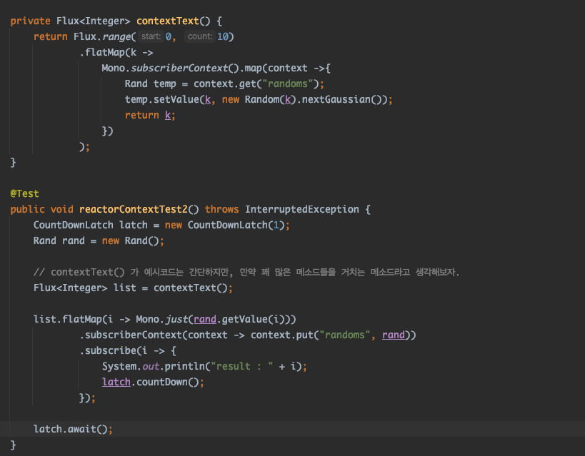
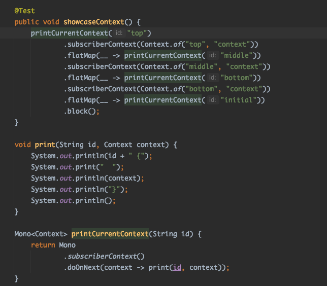

# 리액터 프로젝트 - 리액티브 앱의 기초

## 리액티브 스트림의 수명 주기

### 조립 단계

리액터에서는 빌더패턴과 비슷한 형태로 연산자들을 조립할 수 있도록 제공한다.

빌더 패턴은 하나의 객체에 대해 새로운 메서드가 추가됨과 동시에  객체의 데이터가 변경되지만,  
리액터에서는 불변으로 메서드\(연산자\)가 추가되어도 객체의 내용이 변하지  않고 새로운 객체가 생성된다.

각 연산과정에서 도출된 sourceFlux, mapFlux, filterFlux 는 모두 새로운 객체로 생성된다.

조립의 또 다른 예시. \(내부적으로 최적화가 진행되는 경우\)

concatWith 연산자로 각 변수들을 조합\(조립\)하여 출력한다.

concnatWith 연산자의 내부코드를 보면 변수의 타입이 FluxConcatArray 인지 여부에 따라 다른 함수를 사용하고 있다. 

concatAdditionalSourceLast\(\) 함수에서는 FluxConcnatArray 로 변환시키면서 se1, se2, se3 각 데이터를 모두 하나의 array 에 담아서 리턴.

FluxConcatArray\(FluxConcatArray\(FluxA, FluxB\), FluxC\) -&gt; **FluxConcatArray\(FluxA, FluxB, FluxC\)**

또한 조립 단계에서 각종 훅을 이용하면 중요한 기능들을 추가적으로 사용할 수 있다.

### 

### 구독 단계

Publisher 를 구독할 때 발생.

publisher 들\(sourceFlux, mapFlux, filterFlux\) 연결되어 subscriber 가 전달되는 형식.

구독 순서는 다음과 같다. 

filterFlux publisher 를 subscribe\(\) 하면

1. mapFlux publisher 의 subscribe\(\) 메소드가 호출되고 \(실제 publisher는 FluxFilterFuseable\)
2. sourceFlux publisher 의 subscribe\(\) 메소드가 호출 \(FluxMapFuseable publisher\)
3. Flux publisher 의 subscribe\(\) 메소드가 호출 \(FluxArray publisher\)

결국 arrayFlux 가 모두를 포함한 형태.

 최종적으로 마지막 연산자까지 subscriber 를 전달 완료한 경우에 데이터를 송신을 위한 데이터 요청 메소드를\(request\) 호출한다.

### 런타임 단계

구독 단계에서 subscriber 가 filter -&gt; map -&gt; source 순으로 전파된다고 했다.

sourceFlux 까지 subscriber 가 전파되면 onSubscriber\(\) 메소드가 차례대로 호출되고 \(source -&gt; map -&gt; filter\)

onSubscribe\(\) 메소드가 호출된 후 부터 request\(\) 메소드가 다시 역순으로 호출 된다 \(filter -&gt; map -&gt; source\) 

ArraySubscription 의 request 까지 호출되면 실제 데이터 전송을 시작한다.

아래 코드와 같이 각 단계\(Subscriber\) 마다 특정 조건을 거치면서 데이터가 흐른다.

FilterSubscriber\(...\).onNext\("1"\) 부분에서 필터 처리 및 데이터 추가 호출\(request\(1\)\)

FilterSubscriber\(...\).onNext\("20"\) 부분에서는 구독자에게 20 데이터 전송.

## 리액터에서 스레드 스케줄링 모델

멀티스레딩 환경에서 다른 워커로 작업을 실행할 수 있도록 제공해주는 연산자로

publishOn, subscribeOn, parallel, Scheduler 가 있다.

### publishOn 연산자

런타임 실행의 일부를 다른 워커에서 실행되도록 한다.

parallel-scheduler 라는 이름의 스케줄러를 만들고 4개의 스레드를 생성.

publishOn\(s\) 연산자 부터는 parallel-scheduler 스케쥴러에서 스레드를 가져다가 작업을 진행한다.

publishOn\(\) 은 내부적으로 큐를 가지고 있고 해당 큐로 부터 데이터를 꺼내와 작업을 처리하기 때문에 처리 순서가 보장된다.

### publishOn 연산자를 이용한 병렬 처리

위 그림을 보면 publishOn 을 이용하면 동기적으로 처리되는것 처럼 보이지만, publishOn 연산자를 적용한 시점부터는 다른 스레드에서 실행되기 때문에 병렬적으로 처리된다.

위 그림의 점선 부분이 publishOn 을 적용한 부분이며, 

왼쪽 부분의 두 가지 처리 플로는 메인스레드에서 작업만 진행하고,

오른쪽 부분의 두가지 처리 플로에서 publishOn 에서 지정한 스레드로 작업 및 처리 진행한다.

### subscribeOn 연산자

publishOn 은 onNext, onComplete, onError 메소드를 처리할 스레드를 지정하는 반면,

subscribeOn 은 onSubscribe\(\), subscribe\(\) 를 처리할 스레드를 지정.

subscribeOn 은 "구독 시간 워커와 함께 런타임 워커를 부분적으로 지정"

구독 시간 워커 : onSubscribe\(\), subscribe\(\) 메소드를 처리할 스레드를 지정할때 사용.

런타임 워커를 부분적으로 지정 : 구독시간워커를 통해서 실행된 메소드로부터 데이터가 방출되는 시점의 onNext\(\) 는 구독시간워커의 스레드와 동일한 스레드에서 실행된다. 

아래의 예시코드와 그 결과를 보면서 확인.


참고로 subscribeOn\(\) 메소드는 업스트림에 대해서도 영향을 끼친다. 

\(subscribeOn 보다 위에 조립된 연산자들에게도 영향을 끼친다는뜻.\) 


결과

1. 예시코드의 .subscribe\(\) 메소드가 실행되면서, 맨 위 2줄과 같이 subscribeOn 메소드가 메인 스레드에서 실행
2. subscribeOn\(\), request\(\) 는 subscribeOn 에서 지정된 스레드에서 실행
3. 부분적으로 onNext\(1...3\), onComplete\(\) 가 SUB-1 스레드에서 실행된 이유는 위에서 설명함. \(Subscription.request\(\) 호출 스레드와 동일한 스레드에서 실행됨\)
4.  나머지 onNext, onComplete 는 예상한대로 PUB-2 에서 실행됨.

### parallel 연산자

parralle\(\) 연산자 적용 시, cpu 코어 수 만큼의 Flux 가 병렬로 생성되고 \(ParrallelFlux 타입으로 변환됨.\)

실제 동작은 runOn\(\) 연산자를 통해서 실행된다.

Flux publisher 를 병렬적으로 처리하기 위해 사용한다. \(내부에서는 FluxPublishOn 클래스가 동작한다\)

parrallel\(\) 연산자를 추가하기만 하면 병렬 동작 x. \(Flux 퍼블리셔를 ParrallelFlux 타입으로 변경시키고 하위 연산자들을 ParallelFlux 로 동작하도록 변경한다.\)

runOn\(\) 연산자를 추가해야 병렬적으로 동작하기 시작. \(ParrallelFlux 를 상속받은 ParrallelRunOn 퍼블리셔가 실제 병렬동작을 실행함\)

ParallelRunOn 퍼블리셔의 subscribe\(\) 메소드 내부에서 전달받은 scheduler 를 전달.


parrallell\(\).runOn\(...\) 연산자와 publishOn\(Schedulers.parrallel\(\)\) 의 차이점.

parrallel\(\) 연산자는 Flux 를 병렬적으로 생성하기 때문에 데이터 생성 시 순서가 보장되지 않지만,

publishOn 연산자는 이전 업스트림에서의 데이터 생성 순서는 보장됨.

그리고 publishOn 연산자는 Mono 에서도 사용가능하다.


### Scheduler

병렬 처리를 진행하기 위해 스케줄러를 지정할 수 있다.

3가지 주요한 스케줄러가 있음.

1. SingleScheduler \(Schedulers.single\(\)\)
2. ParallelScheduler \(Schedulers.parallel\(\)\)
3. ElasticScheduler \(Schedulers.elastic\(\)\)

SingleScheduler 는 하나의 단일 스레드를 추가하여 작업을 처리할 때 사용. \(사용 확률이 낮음\)

ParallelScheduler 는 고정된 스레드 풀을 기반으로 스레드를 사용함. \(cpu 의 코어 수\)

ElasticScheduler 는 필요 시 스레드를 무한정 증가시키며 블로킹 작업에 사용한다.

### 리액터 컨텍스트

리액터 컨텍스트를 이용하면 리액터 스트림의 처리흐름 내부에서 언제든지 데이터에 접근 가능하며,

비동기 병렬스레드 환경에서도 문제없이 사용가능하다.

webflux 의 처리흐름은 Mono, Flux 로 부터 시작되며 작업 흐름이 끝날때까지\(구독 되기전까지\) 스트림은 이어져 있다. \(마치 올가미처럼 ..\)

\(또한 연결된 스트림을 따라 데이터를 처리하는 과정 중에 스레드가 변경될 수도 있다.\)

책에 나온 예시코드를 보면

리액터 컨텍스트는 컨텍스트의 데이터를 사용하려는 연산자의 위치보다 아래쪽에서 컨텍스트 인스턴스를 생성한다.

\(.subscriberContext\(context -&gt; context.put\(...\)\) 부분\)

사용하려는 연산자 내부에서는 Mono.subscriberContext\(\).map, .doOnNext 연산자를 이용하여 내부 컨텍스트 데이터에 접근할 수 있다.

컨텍스트는 한번 put 되면 모든 이어져 있는 모든 스트림에서 이용가능하기 때문에 굉장히 유용하게 사용될 수 있다. 

책에 나온 예시코드를 보면 리액터 컨텍스트는 업스트림에서는 다운스트림의 컨텍스트를 참조하여 데이터를 병합하는 것을 확인할 수 있다.

## 프로젝트 리액터의 내부 구조

### 매크로 퓨전

주로 조립단계에서 연산자를 최적화시켜주는 작업\(연산자를 다른 연산자로 변환\)을 해준다. 

앞절의 "조립단계" 에서 타입을 확인 후 내부 로직을 최적화 했었다.

concatWith\(\) 내부 로직에서 FluxConcatArray 인 경우 concnatAdditionalSourceLast\(\) 메소드로 로직을 최적화함.

책의 예시코드를 보면, flux.just\(\) 에 publishOn\(\) 을 호출하는데 publishOn\(\) 은 앞에 설명했다시피 큐를 생성하고 큐의 원소를 입출력을 위한 별도의 작업이 필요하다.

그런데 publishOn\(\) 의 내부를 보면 아래와 같이 ScalarCallable 인 경우 FluxSubscribeOnValue\(\) 함수를 호출한다. 

\(Flux.just\(\) 는 Fuseble.ScalarCallable 인터페이스를 구현하고 있음\)

### 마이크로 퓨전

마이크로 퓨전은 2~ 개이상의 연산자들이 서로 데이터를 요청/공유하는 런타임 과정에서의 최적화를 말한다.

간단히 아래의 예시코드를 보면 filter 에서 조건을 충족하지 못할 경우 다시 request\(\) 메소드를 호출하여 데이터를 업스트림으로부터 받아온다.

request\(\) 메소드는 volatile 필드 변수를 이용하는데 volatile 변수는 캐시를 이용하지 않기 때문에 작업 비용이 많이든다. 

그래서 연산자 내부에 request\(\) 호출을 최소화 하기 위한 내부 최적화 작업을 마이크로 퓨전이라고 하는데, 위 코드에서 최대 10개의 데이터를 각각 필터를 거쳐서 1개 씩 다시 받아오는게 아닌 처음부터 모두 request\(\) 한다.

\(대부분의 작업의 경우 just, range 등 특정 개수가 모두 정해져 있으므로... 이러한 마이크로 퓨전이 가능한듯 싶다.\)

아래 실행 예시를 보면 데이터를 계속해서 request\(\) 해오는 방식이 아닌 Long,MAX\_VALUE 만큼 요청하여 작동하는것을 볼 수 있다. 

FluxRange 클래스의 fastPath\(\) 메소드로 들어온 경우 for\(\) 메소드 부분에서 20개 데이터를 모두 배치처리? 처럼 진행 하는것을 볼 수 있다.

그렇기 때문에 FluxFilter 에는 request\(\) 를 호출하는 부분을 찾아볼수가 없. \(FluxRange 에서 알아서 tryOnNext 를 통해 데이터를 전달해주기 때문...\)

tryOnNext 메서드는 ConditionalSubscriber 인터페이스에 존재하는 메서드로 "마이크로 퓨전" 유형의 인터페이스 라고 한다.

ConditionalSubscriber 인지에 따라 RangeSubscription\(\), RangeSubscriptionConditional\(\) 을 선택하고 RangeSubscriptionConditional\(\) 은 ConditionalSubscriber 구독자 클래스를 이용한다.

